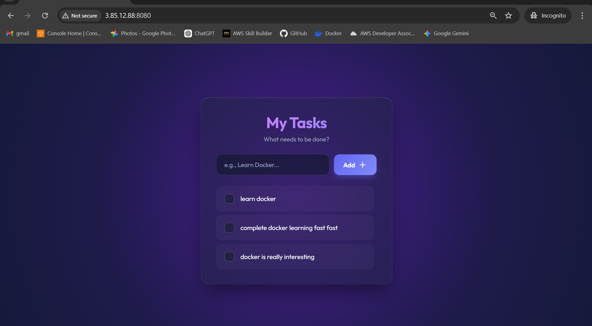
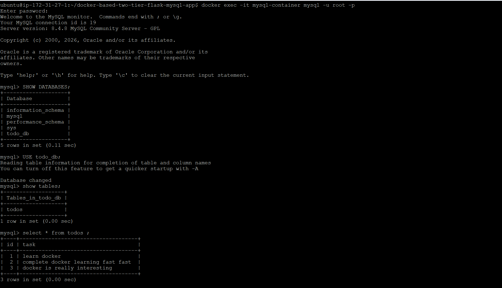
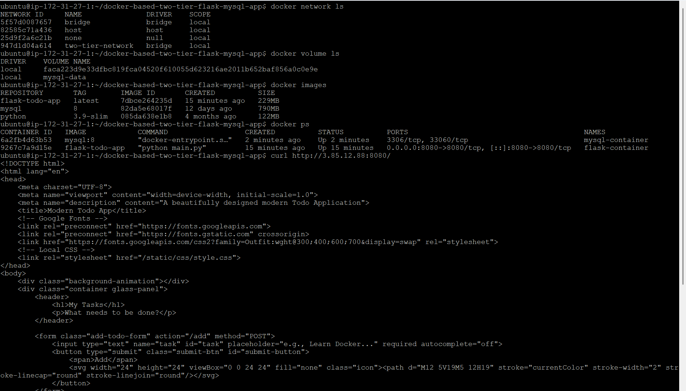
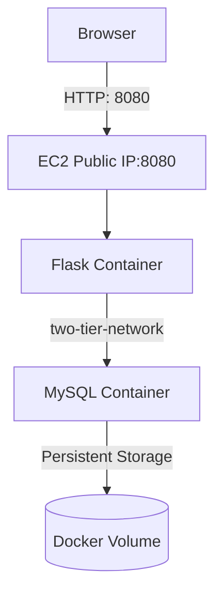

# 🚀 Two-Tier Flask + MySQL Application
Dockerized Deployment on EC2 (Ubuntu)



**Project Repository:**
🔗 [github.com/agravi987/docker-based-two-tier-flask-mysql-app](https://github.com/agravi987/docker-based-two-tier-flask-mysql-app)

## 🏗 Architecture Overview

- 🖥 **EC2 Ubuntu Instance**
- 🐳 **Docker Engine**
- 🌐 **Custom Docker Bridge Network**
- 🐬 **MySQL Container**
- 🐍 **Flask Application Container**
- 💾 **Docker Volume** for Persistent Database Storage

---

## 1️⃣ Launch EC2 Instance

- **AMI:** Ubuntu 22.04 LTS
- **Instance Type:** `t2.micro` (Free Tier)
- **Open Inbound Ports:**
  - `22` (SSH)
  - `8080` (App access)

SSH into instance:
```bash
ssh ubuntu@<your-public-ip>
```

---

## 2️⃣ Install Docker

```bash
sudo apt-get update
sudo apt-get install -y docker.io
```

Add user to docker group:
```bash
sudo usermod -aG docker $USER
newgrp docker
```

Verify:
```bash
docker --version
```

---

## 3️⃣ Clone Project Repository

```bash
git clone https://github.com/agravi987/docker-based-two-tier-flask-mysql-app.git
cd docker-based-two-tier-flask-mysql-app
```

---

## 4️⃣ Create Docker Network

Create isolated bridge network for container communication:
```bash
docker network create two-tier-network
```

Verify:
```bash
docker network ls
```

---

## 5️⃣ Run MySQL Container (Initial Setup)

```bash
docker run -d \
  --name mysql-container \
  --network two-tier-network \
  -e MYSQL_ROOT_PASSWORD=password \
  -e MYSQL_DATABASE=todo_db \
  mysql:8
```

Check logs to ensure it's ready:
```bash
docker logs mysql-container
```
*(Wait until you see: `ready for connections`)*

---

## 6️⃣ Build Flask Application Image

From the project root directory:
```bash
docker build -t flask-todo-app .
```

Verify image:
```bash
docker images
```

---

## 7️⃣ Run Flask Container

```bash
docker run -d \
  --name flask-container \
  --network two-tier-network \
  -p 8080:8080 \
  -e DB_HOST=mysql-container \
  -e DB_USER=root \
  -e DB_PASSWORD=password \
  -e DB_NAME=todo_db \
  flask-todo-app
```

Verify running containers:
```bash
docker ps
```

Test locally:
```bash
curl localhost:8080
```

Test via browser:
```text
http://<your-ec2-public-ip>:8080
```

---

## 8️⃣ Verify Database Data

Access the MySQL container:
```bash
docker exec -it mysql-container mysql -u root -p
```
*(Enter the password when prompted)*

Inside MySQL:
```sql
SHOW DATABASES;
USE todo_db;
SHOW TABLES;
SELECT * FROM todos;
```



---

## 9️⃣ Implement Persistent Storage (Docker Volume)

### Create Volume
```bash
docker volume create mysql-data
```

Verify:
```bash
docker volume ls
docker volume inspect mysql-data
```

### Recreate MySQL Container With Volume

Remove the old container:
```bash
docker rm -f mysql-container
```

Run again with the mapped volume:
```bash
docker run -d \
  --name mysql-container \
  --network two-tier-network \
  -e MYSQL_ROOT_PASSWORD=password \
  -e MYSQL_DATABASE=todo_db \
  -v mysql-data:/var/lib/mysql \
  mysql:8
```

Now database files are stored locally on the host machine at:
`/var/lib/docker/volumes/mysql-data/_data`

This ensures:
- ✅ Data persists even after the container is deleted or recreated
- ✅ Production-like database storage behavior

---

## 🔟 Application Verification

Test again to ensure everything is working:
```bash
curl http://localhost:8080
curl http://<public-ip>:8080
```

Verify everything is up and running:
```bash
docker ps
docker images
docker network ls
docker volume ls
```



---

## 🧹 Maintenance & Cleanup Commands

Stop and remove a specific container:
```bash
docker stop <container-id>
docker rm <container-id>
```

Remove a specific image:
```bash
docker rmi <image-id>
```

Remove all unused images:
```bash
docker image prune -a
```

---

## 🏛 Final Architecture Diagram (Logical)

